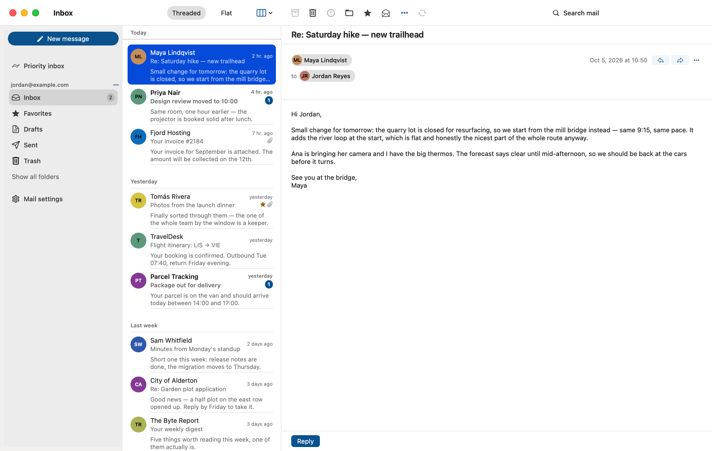

<!--
SPDX-FileCopyrightText: Hamza Mahjoubi
SPDX-License-Identifier: AGPL-3.0-or-later
-->

# Nextcloud Mail for macOS

A native macOS client for [Nextcloud Mail](https://github.com/nextcloud/mail) and Contacts.
Local-first: your mail lives in a database on your Mac, so reading, search and triage all
work offline and the network only syncs.



> **Not affiliated with Nextcloud.** This is an independent, unofficial client, not
> affiliated with or endorsed by Nextcloud GmbH. *Nextcloud* is a trademark of
> Nextcloud GmbH.

## Install

Download `NextcloudMail-<version>.dmg` from
[GitHub Releases](https://github.com/hamza221/nc-mac-mail/releases) and drag the app to
Applications. Releases are signed with Developer ID and notarized. Or build from source:
see [Development](#development).

After that the app updates itself. It checks once a day, and App ▸ Check for Updates…
checks right away. If an update arrives while you are busy, the sidebar shows a line
instead of a window taking focus. Settings ▸ General ▸ Updates chooses the channel:
**Stable**, or **Beta**, which also gets pre-releases. Beta builds start on Beta. Builds
older than the first one with the updater have to be replaced by hand once.

## Use

- Sign in with your Nextcloud server URL; the login finishes in your browser and the app
  keeps an app password in your Keychain.
- Everything is mirrored locally — read, full-text search and triage your mail offline;
  your actions queue up and sync back when you reconnect.
- Compose with send-later and undo send; drafts stay on the server.
- Contacts have their own section in the sidebar.
- Settings ▸ accounts, signatures, filters and app preferences.

The full specification — architecture, UX spec and every decision — is in
[docs/](docs/README.md); contributor conventions are in [AGENTS.md](AGENTS.md).

## Development

Xcode 26.6 (pinned in `.xcode-version`), which brings Swift 6.3.3. SwiftLint from Homebrew.
`swift format` is a subcommand of the toolchain, not a binary you install.

```sh
make setup       # resolve dependencies, check the tools are present
make build       # every package, warnings as errors
make test        # every package's tests
make build-app   # xcodebuild the app target
make app         # build it and launch it
make lint        # swift format --strict, then swiftlint --strict
make format      # apply formatting in place
```

Two toolchain traps, both already handled for you:

- **Prefer `make build-app` over bare `xcodebuild`, though both now work.** Until
  `NextcloudUI` 1e753cb, its manifest's `.treatAllWarnings(as: .error)` collided with the
  `-suppress-warnings` Xcode gives every package target, so bare `xcodebuild` and Cmd-B
  failed inside the library. Fixed upstream
  ([docs/feedback/library-feedback.md](docs/feedback/library-feedback.md)); the Xcode GUI
  builds this project.
- The Makefile passes `SUPPRESS_WARNINGS=NO`, because Xcode otherwise hides warnings in
  this project's own packages; two GRDB warnings come along as the price
  ([ADR-0016](docs/decisions/0016-warnings-as-errors-at-the-build-command.md)).

The committed project signs ad hoc so it builds on any Mac and on CI with no Apple
account; for a locally signed build and the sandbox details, see
[ADR-0018](docs/decisions/0018-ad-hoc-signature-in-the-checked-in-project.md).

### Releasing

Bump `MARKETING_VERSION` and `CURRENT_PROJECT_VERSION` in every target, push to `main`,
then run:

```sh
brew install create-dmg
NOTARY_PROFILE=<notarytool keychain profile> Scripts/release.sh
```

`Scripts/release.sh` does the whole release:

- Builds Release with Developer ID through `Scripts/make-dmg.sh`, which gives the DMG its
  styled background and an `/Applications` drop link, and re-signs Sparkle's helpers.
- Notarizes and staples the DMG.
- Signs it for the in-app updater.
- Tags `v<version>` and publishes the GitHub release with generated notes. A version
  like `0.4.0-beta` becomes a pre-release.
- Adds the item to [`appcast.xml`](appcast.xml), the feed the app reads, tagging
  pre-releases for the beta channel only.

The update signature uses the EdDSA key stored in the login Keychain under account
`nc-mac-mail`. If that key is lost, users can no longer receive updates. Keep a backup
made with Sparkle's `generate_keys --account nc-mac-mail -x <file>`. See
[ADR-0108](docs/decisions/0108-in-app-updates-use-sparkle-outside-ncmailnet.md).

Pushing a tag no longer publishes anything from CI. If CI replaced the DMG after the
feed was written, every update to that version would fail. The **Release build**
workflow still builds a DMG for a tag on request and keeps it as a workflow artifact.
With no secrets set, that DMG holds an ad-hoc-signed app (ADR-0018).

## Licence

AGPL-3.0-or-later, matching Nextcloud Mail and `NextcloudUI`.
